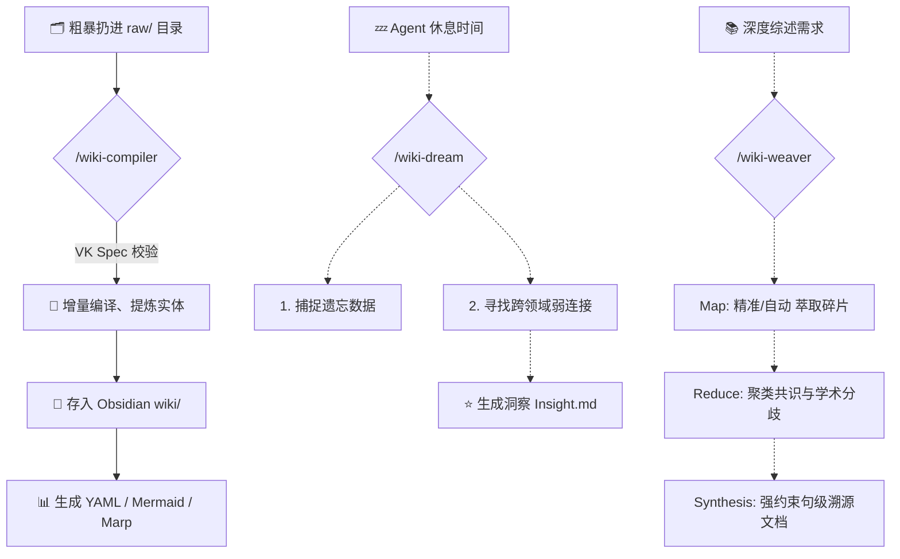

  <h1>🧠 Wiki Compiler V3: 纯血学术级 Agent 知识编排引擎</h1>
  
<strong>复刻 Andrej Karpathy 的 LLM 知识库理念，终结“只记不读”的数字化囤积症</strong>

  
基于 <strong>VK Spec 1.0</strong> 协议，实现从原始素材到学术综述的全自动闭环。

---

## 🌟 缘起：笔记是 LLM 的领地

Andrej Karpathy 曾指出：**不要再痛苦地手写笔记！** 现在的研究流应该是：
1. 粗暴地搜集资料（`raw/`）。
2. 让 LLM 作为“编译器”，利用 **Map-Reduce** 范式将其提炼、互联、归档（`wiki/`）。
3. 让它在深夜“沉思”，自动生成跨领域的 **Insight**。

**Wiki Compiler V3** 不仅 1:1 实现了这一构想，更确立了个人知识库的自动化工业标准。

---

## 🔥 V3 核心革命性特性

### 1. 📍 精准编织：Weaver 2.1 (Map-Reduce)
不再仅仅依赖算法推荐！V3 引入了 **`--files` 手动指定模式**。你可以对 Agent 下令：“针对这 5 篇特定文献进行交叉论证。”
- **学术级综述**：通过 Map-Reduce 任务流，并自动执行**“句级溯源 (LSC)”**——每一句结论必带 `[[引文]]`，彻底告别 AI 幻觉。

### 2. 🌌 深夜“做梦”机制 (Nightly Dreaming)
触发 `/wiki-dream`，Agent 进入沉思模式：
- **主动巡逻**：扫描遗忘处理的生数据。
- **灵感碰撞**：在看似无关的知识点之间寻找“弱连接”，结晶产生全新的 `Insight.md` 系节点。

### 3. 🛡️ VK Spec 1.0 协议守卫
确立了行业领先的 **Wiki Compiler Specification**：
- **目录标准化**：强制 `raw/`, `wiki/`, `.meta/` 三层拓扑。
- **成熟度模型**：定义从 `stub` 到 `authoritative` 的笔记生命周期，让你的二楼大脑具备类似 WikiPedia 的严谨性。

### 4. 🚀 幂等增量编译 (Idempotent Sync)
哈希防重叠引擎。无论执行多少次 `/wiki-compiler`，系统只处理新增或修改后的文件，绝不让内容“滚雪球”式冗余。

---

## 🛠 工作流机理 (VK Workflow)

---

## 🚀 极简起手式 (Quick Start)

1. **Clone 本仓库** 并集成到你的 AI 工作流中。
2. **设定路径**：指定你的 `raw/` 资料库与 `wiki/` 知识库。
3. **开始编译**：对话框输入 `/wiki-compiler`。
4. **深夜做梦**：通过 `/wiki-dream` 发现你笔记库中沉睡的价值。
5. **精准综述**：使用 `/wiki-weaver --files "A.md,B.md"` 开展你的课题研究。

---

## 🗺️ 未来路线图 (Roadmap)
- **V3.1**：矛盾检测引擎（自动识别文献间的观点冲突）。
- **V3.2**：知识图谱持久化（支持图语义查询）。
- **V4.0**：知识蒸馏（将笔记库转化为本地模型的微调数据集）。

---

> _"I rarely touch the wiki directly. It's the domain of the LLM." – Andrej Karpathy_
> **Wiki Compiler V3 让这句话成为了现实。**

🔗 **GitHub 仓库**：[zhangpelf/wiki-compiler](https://github.com/zhangpelf/wiki-compiler)
