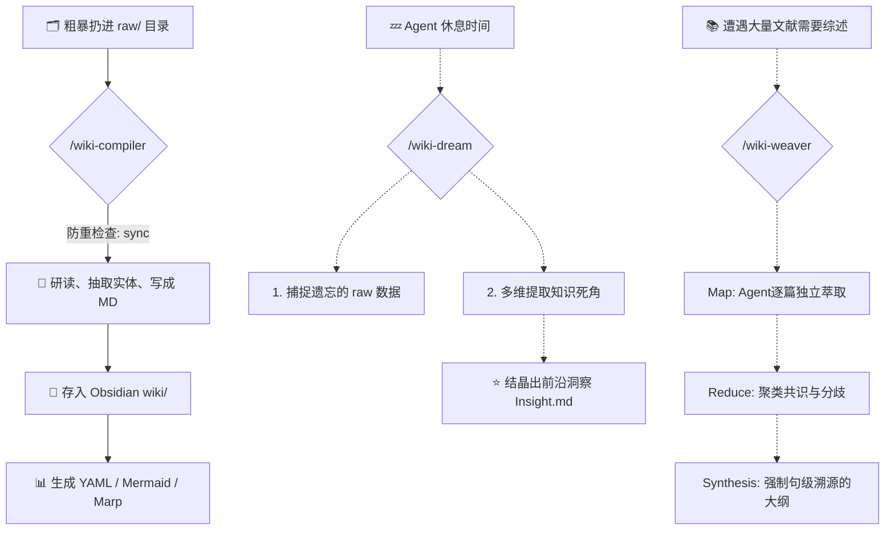

  <h1>🧠 Wiki Compiler V2: 纯血学术级 Agent 知识编排引擎</h1>
  
<strong>复刻 Andrej Karpathy 的 LLM 知识库理念，融合深层做梦流与强约束 Map-Reduce 综述架构</strong>

  
完全由 AI 自主驾驶、零幻觉守卫、运维、除草与沉思的 Obsidian 第二大脑工厂。

---

## 🌟 为什么创造它？

Andrej Karpathy 曾在推特中分享了一个极其高效的现代研究流：**不要再自己痛苦地写笔记！**把所有的论文、文章、截图粗暴地扔进一个 `raw/` 文件夹中，然后让 LLM 作为“知识库编译器 (Wiki Compiler)”，自动把它们提炼、打双链、分类到结构化的 Obsidian 知识库中。

我们不仅 1:1在本地实现了 Karpathy 的构想，甚至走得更远——我们为其引入了源自最前沿 Agent 架构的 **"Dreaming (做梦/沉思) 机制"** 以及硬核的 **Idempotent (幂等去重扫描)**。

这不再只是一堆 Python 脚本，而是一个 **活着的、会自我反思的知识管家**。

## 🔥 核心革命性特性

### 1. 🛡️ 幂等增量编译 (Idempotent Sync)
告别 AI 重复造词和内容滚雪球的噩梦！内置强大的哈希防重叠引擎。
无论你触发多少次编译指令，系统只会揪出 `raw/` 文件夹下**新增或修改过**的文件。丢入资料，忘掉它，执行 `/wiki-compiler`——剩下的交给 AI。

### 2. 🌌 Claude 式"做梦"机制 (Night Watcher & Latent Walk)
当你的大模型闲置时，不如让它做个梦（通过 `/wiki-dream` 唤醒）：
- **夜间巡逻 (Night Watch)**：它会首先帮你扫描并捞起那些被你随手扔弃但“遗忘处理”的生数据，主动问你：“主人，需要顺手帮你把这 3 份文件入库吗？”
- **灵感跨界 (Latent Connection)**：系统独创的 **Gap/Stale/Bridge/Tag 多维加权算法**不再是掷骰子，它会挑出被遗忘的“幽灵卡片”或“高频交通枢纽”，强制 AI 在风马牛不相及的知识碎片中寻找关联，结晶产生出全新的跨界洞见 (Insight)！

### 3. 🤔 裁判级防御质检 (Defensive Linting)
**【V2 核心进化】** 传统 RAG 最怕大模型遇到盲区时“发散脑补”。
V2 的健康体检引擎采用了极其严苛的**防御性隔离守则**。在面对断链或死链时，它绝不强行捏造概念，而是提取库内所有的源头上下文片段，生成一张醒目的 `status: ⚠️ Definition_Needed` 锚点警告追踪卡。将“知识盲区”彻底显性暴露给接管循环审查的“真理裁判模型”与人类。守护领空，滴水不漏，绝不让一粒幻觉老鼠屎污染你的学术大脑！

### 4. 🕸️ 织网者：Map-Reduce 学术综述引擎 (Wiki Weaver)
**【V2 重磅主打】** 让 Agent 真正像一个不用睡觉的牛马科研助理一样打工！
触发 `/wiki-weaver` 进入极其狂暴的文献综合加工流。引擎放弃了传统的“无脑大一统长文本填喂”，彻底转向**原生的 Agentic Map-Reduce 流水线**：
- **Map阶段**：底层 Python 探针仅嗅探和派发绝对路径，指令大模型作为节点独立、并行动用原生工具逐篇萃取几十篇文献的论据元数据。
- **Reduce阶段**：清洗聚类，寻找研究共识与突兀的学术分歧。
- **Synthesis约束**：执行最高级别的**“句级溯源死锁”**：最终出炉的大纲产出的每一句结论，句末必须标注形如 `[[原始研报]]` 的具体出处卡片引用！如果查无出处，推断直接无脑抹除。

### 5. 🚀 Obsidian 原生“降维”可视化
不需要外挂复杂的图表前端，AI 会默契地直接生成带 Obsidian 专属特性的极客级 Markdown：
- **自带 Dataview Metadata**：所有笔记强制约束 `Maturity` (成熟度) 等生命周期 YAML 标签。V2 更支持利用 `--apply-tags` 基于图论中心度等算法全自动向文章注入标签阵列！
- **自动伴生 Marp 幻灯片**：针对宏大的知识主题，AI 编译时顺带甩你一份 `.marp.md`，点开网页一键 PPT 演讲，逼格直接拉满。

---

## 🛠 工作流机理

## 🚀 极简起手式 (Quick Start)

1. 下载或 Clone 本仓库作为你的 Agent Skills 之一。
2. 告诉你的 Agent 你的 `raw/` 资料库绝对路径以及 `wiki/` 知识库绝对路径。
3. 对话框内输入：`/wiki-compiler`。
4. 躺平，看看 AI 是如何像真正的学者一样为你整理书架的。
5. 偶尔输入 `/wiki-dream`，迎接思维碰撞的潜意识彩蛋！
6. 需要干大活时，对主题输入 `/wiki-weaver`，让分身打工仔去爆肝 Map-Reduce 溯源综述。

> _"I rarely touch the wiki directly. It's the domain of the LLM." – Andrej Karpathy_
> **现在的 Wiki Compiler V2，让这句话背后的底气更硬了。**

---

### *📜 附文：作为 Agent Skill 的执行规范*
> 下方内容为系统 `SKILL.md` 的原文架构，指导任意大语言模型进行本系统的运维工作（LLM Prompting Directive）：

*(详见当前库内的 `SKILL.md`)*
