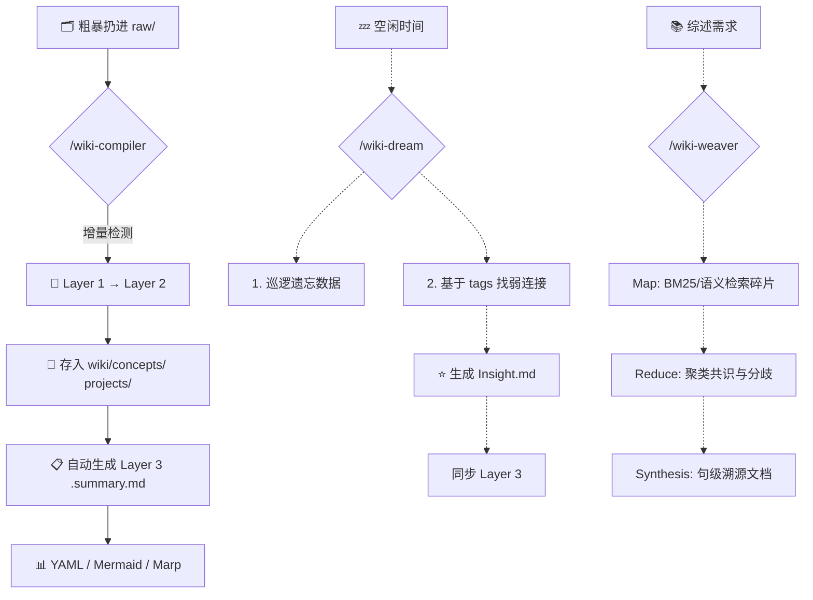

<div align="center">
  <h1>🧠 Wiki Compiler V3: 三层卷积知识架构</h1>
  <p><strong>借鉴 CNN 卷积层思想：Raw → Refined → Summary，逐层压缩、按需下钻</strong></p>
  <p>复刻 Andrej Karpathy 的 LLM 知识库理念，终结“只记不读”的数字化囤积症</p>
</div>

---

## 🌟 核心理念：三层卷积架构

借鉴 CNN 逐层缩小感受野、压缩特征的思想，建立三层渐进式知识表示：

```
Layer 1 (Raw)       → 全量原始资料          感受野最大，信息最全
Layer 2 (Refined)   → 精炼 Markdown + 双链   结构化压缩
Layer 3 (Summary)   → 总结 + 标签索引         最小粒度，快速定位
```

**访问路径（逐层下钻）**：
```
Layer 3 (扫描标签/总结) → Layer 2 (精炼版) → Layer 1 (全文)
```

---

## 🔥 V3 核心特性

### 1. 三层索引自动生成
每次 `/wiki-compiler` 编译完 Layer 2 后，**自动生成对应的 Layer 3 `.summary.md`** 到 `.index/` 目录：

```yaml
---
tags: [土地利用, 景观格局, 空间分析]
summary: "一句话核心结论"
source: "[[某篇Layer2文件]]"
source_raw: "raw/原始文件名.pdf"
created: 2026-07-27
maturity: reviewed
---
一句话核心结论（2-3 句扩展说明）
```

### 2. 增量编译引擎
- 哈希防重叠：只处理新增/修改文件
- 自动检测缺失的 Layer 3 summary 并补齐
- `.index/compiled_ledger.json` 账本管理

### 3. 深夜"做梦"机制
`/wiki-dream` 基于 Layer 3 的 tags 做结构感知采样：
- **Gap 型**：被引用多但内容极短（幽灵概念/stub）
- **Stale 型**：修改时间最久远（年久失修）
- **Bridge 型**：出链异常多的枢纽节点

### 4. Map-Reduce 学术综述
`/wiki-weaver` 支持 `--files` 手动指定模式，句级溯源（LSC），每句必带 `[[引文]]`

### 5. VK Spec 1.0 协议
- 目录标准化：强制 `raw/`, `wiki/{concepts,projects}`, `.index/`
- 成熟度模型：`stub → draft → reviewed → authoritative`

---

## 📁 目录拓扑

```
WIKI_DIR/
├── raw/                    # Layer 1: 原始素材（只读）
│   ├── papers/
│   ├── notes/
│   └── web/
├── wiki/                   # Layer 2 + 3
│   ├── concepts/           # 精炼概念文章
│   ├── projects/           # 精炼项目文章
│   ├── .index/             # Layer 3: 总结+标签索引
│   │   ├── xxx.summary.md
│   │   └── compiled_ledger.json
│   └── ...
```

---

## 🛠 极简起手式

```bash
# 1. Clone 并配置路径
git clone https://github.com/zhangpelf/wiki-compiler
# 设置 RAW_DIR 和 WIKI_DIR 环境变量或在对话中指定

# 2. 扔进原始资料
cp ~/Downloads/paper.pdf /path/to/raw/

# 3. 增量编译（自动生成 Layer 2 + Layer 3）
/wiki-compiler

# 4. 深夜做梦（发现跨域连接）
/wiki-dream

# 5. 精准综述（指定文件交叉论证）
/wiki-weaver --files "A.md,B.md,C.md"

# 6. 查看状态
/wiki-status
```

---

## 🗺️ 访问流程图


```mermaid
graph TD
    A[🗂️ 粗暴扔进 raw/] --> B{/wiki-compiler}
    B -->|增量检测| C[🤖 Layer 1 → Layer 2]
    C --> D[💾 存入 wiki/concepts/ projects/]
    D --> E[📋 自动生成 Layer 3 .summary.md]
    E --> F[📊 YAML / Mermaid / Marp]
    
    Z[💤 空闲时间] -.-> G{/wiki-dream}
    G -.-> H[1. 巡逻遗忘数据]
    G -.-> I[2. 基于 tags 找弱连接]
    I -.-> J[⭐ 生成 Insight.md]
    J -.-> K[同步 Layer 3]
    
    W[📚 综述需求] -.-> L{/wiki-weaver}
    L -.-> M[Map: BM25/语义检索碎片]
    M -.-> N[Reduce: 聚类共识与分歧]
    N -.-> O[Synthesis: 句级溯源文档]
```

---

## 🗺️ 未来路线图

| 版本 | 目标 |
|------|------|
| **V3.1** | 矛盾检测引擎（自动识别文献间观点冲突） |
| **V3.2** | 知识图谱持久化（Neo4j/Cytoscape 语义查询） |
| **V3.3** | Layer 3 可视化 Dashboard（Dataview + 图谱） |
| **V4.0** | 知识蒸馏（笔记库 → 本地模型微调数据集） |

---

## 📜 设计源

> "I rarely touch the wiki directly. It's the domain of the LLM." — **Andrej Karpathy**

Wiki Compiler V3 让这句话成为了现实：人只管扔素材，三层卷积架构自动完成从原始素材到可检索知识库的全流程编译。

---

🔗 **GitHub 仓库**：[zhangpelf/wiki-compiler](https://github.com/zhangpelf/wiki-compiler)